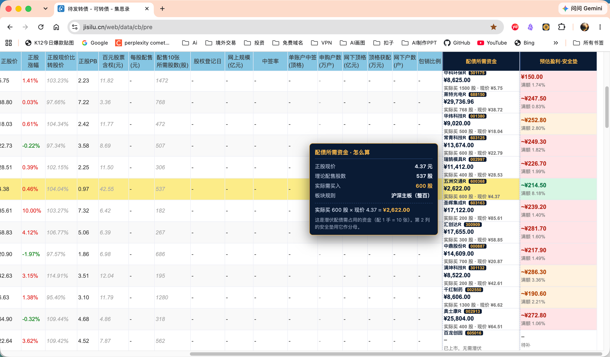
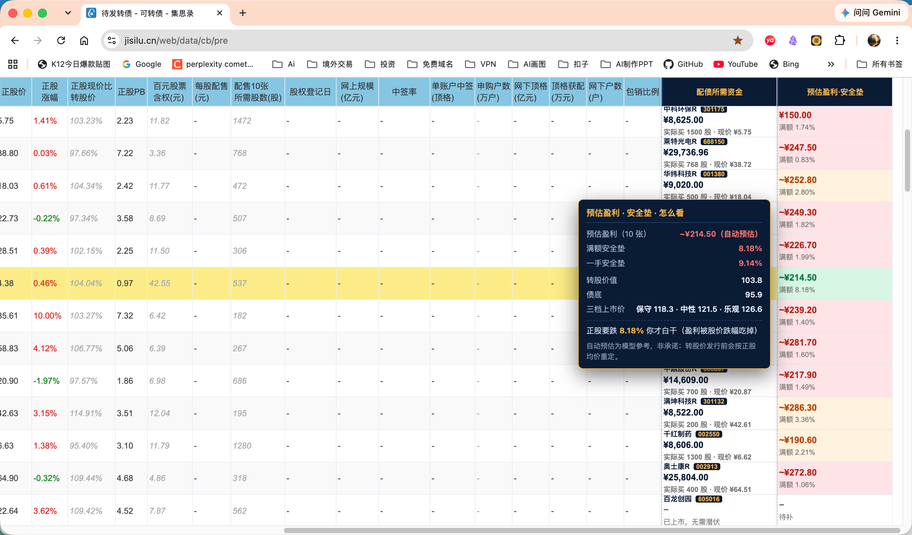

# 集思录待发转债增强插件

> 一个纯本地运行的 Chrome 浏览器扩展，用于在集思录「待发转债」页面补充个人所需的配债资金与安全垫计算列。所有代码独立原创，不读取会员接口、不绕过访问控制、不上传任何数据。

本扩展为个人投资研究辅助工具，**与集思录官方无关**，也不代表其立场。示例截图中的页面 UI 版权归原网站所有，仅用于展示本扩展效果。

## 效果预览





## 核心功能

在集思录待发转债页原表右侧新增两列：

| 列名 | 含义 |
| --- | --- |
| **配债所需资金** | 按板块规则向上取整后的实际买入股数 × 正股现价 |
| **预估盈利·安全垫** | 基于用户预估盈利，计算满额安全垫与一手安全垫 |

悬浮单元格可查看详细计算过程与自动预估模型给出的三档上市价。

## 安装方法

1. 克隆本仓库到本地。
2. 进入 `jisilu-enhancer/` 目录，运行 `npm test` 确认测试通过。
3. Chrome 打开 `chrome://extensions/`，开启右上角「开发者模式」。
4. 点击「加载已解压的扩展程序」，选择 `jisilu-enhancer/` 目录。
5. 打开 `https://www.jisilu.cn/web/data/cb/pre/`，原表右侧应出现新增的两列。
6. 刷新页面（Cmd+R / Ctrl+R）确保 content script 注入。

## 使用方法

- 首次安装后，点击「预估盈利·安全垫」列的单元格，在抽屉面板中填写「获配 10 张的预估盈利总额」。
- 未填写时该列显示「待补」，不会以 0 误导。
- 鼠标悬停在金额/安全垫单元格上，可查看完整计算拆解、板块规则、三档预估上市价、债底与转股价值。
- 预估盈利支持「保守 / 中性 / 乐观」三档切换。

## 核心原理

### 1. 数据从哪里来

- **页面数据**：从集思录待发转债页现有的免费可见单元格读取（所需股数、正股价、转股价、评级、规模、股权登记日等）。
- **正股代码**：页面没有独立的「正股代码」列，本扩展从行内 `/data/stock/<code>` 链接提取。
- **行情**：优先调用腾讯财经接口批量取实时价；失败时兜底东方财富；再失败则使用页面已展示的正股价或本地缓存。
- **所有数据仅在浏览器本地处理**，不经过任何第三方服务器。

### 2. 计算口径

- **实际买入股数**：按板块取整
  - 688 开头（科创板）：200 股起，1 股递增
  - 300/301 开头（创业板）：向上取整到 100 股
  - 4/8/92 开头（北交所）：向上取整到 100 股（保守处理）
  - 其余（主板）：向上取整到 100 股
- **配债所需资金** = 实际买入股数 × 正股现价
- **满额安全垫** = 预估盈利 ÷ 配债所需资金
- **一手安全垫** = (一手股数 × 10 ÷ 所需股数 × 每张利润) ÷ 一手金额
- **潜伏截止日**：以页面「股权登记日」为准；登记日为 `-` 表示尚未排期，仍可计算；登记日 ≤ 今天则视为不可潜伏。

### 3. 自动预估模型

自动预估盈利采用「经验曲线做锚 + LSM 理论价值做边界」的混合模型：

- 以转股价值 `CV = 正股价 / 转股价 × 100` 为锚，基础溢价率随 CV 递减。
- 规模修正：小盘 +10%，大盘 −2%。
- 评级修正：从 AAA 到 A− 给予 +3% 到 −4% 的利差调整。
- 情绪档：保守 −3%、中性 0、乐观 +5%。
- 边界约束：上市价不低于债底（XNPV），不高于 157.30 涨停帽。

> 注意：自动预估仅供参考，转股价在发行前会按正股均价重定，实际上市价受市场情绪影响，可能与模型差异较大。

### 4. 工程实现要点

- **MV3 架构**：`manifest_version: 3`，`content_scripts` 注入页面，`service_worker` 负责批量行情请求与缓存。
- **隔离世界**：content script 运行在 isolated world，与页面 JS 互不干扰。
- **DOM 注入**：向 element-ui 双表格结构注入列时，必须在表头/表体两个 `colgroup` 同步插入 `<col>`，并把新列追加到整行末尾；同时注意 element-ui 表头末尾存在一个 0 宽 gutter 列，注入的 col 必须插到 gutter 之前，否则会被压成 0 宽。
- **自愈机制**：由于第三方框架可能部分清理注入节点，本扩展把关键不变量（注入 th 数、col 数、两表等宽）编码成周期性检查，异常时自动重建。
- **Context 防护**：MV3 dev-reload 后旧 content script 的异步回调仍可能触发，扩展加了 `contextAlive()`、`safeSendMessage()`、`stopSelfHeal()` 防止抛出 `Extension context invalidated`。

## 项目结构

```
jisilu-enhancer/
├── manifest.json              # 扩展配置
├── package.json               # 测试脚本与依赖
├── README.md                  # 本文件
├── .gitignore
├── background/
│   └── service-worker.js      # 行情批量请求、缓存、降级
├── config/
│   └── selectors.js           # 列名→索引映射
├── content/
│   ├── jisilu-pre.js          # 主注入脚本（核心渲染与自愈）
│   └── ui/
│       ├── panel.js           # 抽屉面板
│       ├── tooltip.js         # 悬浮提示
│       ├── styles.css         # 样式源文件
│       └── styles.js          # CSS 内嵌脚本（由 gen-styles-js.js 生成）
├── core/                      # 纯函数计算模块
│   ├── calc.js                # 金额与安全垫计算
│   ├── predict.js             # 自动预估盈利
│   ├── quotes.js              # 行情解析
│   ├── rounding.js            # 板块取整规则
│   ├── color.js               # 涨跌颜色
│   ├── dates.js               # 日期处理
│   └── rules.js               # 潜伏规则
├── storage/
│   └── repository.js          # chrome.storage 封装
├── tools/
│   ├── verify-calc.js         # 双实现交叉校验
│   ├── verify-live.cjs        # 真页验收
│   ├── verify-extension.cjs   # 扩展静态验证
│   ├── gen-styles-js.js       # CSS → JS 生成器
│   └── make-icons.py          # 图标生成
├── tests/                     # 单元测试与回归测试
│   ├── core.test.js
│   ├── parsing.test.js
│   ├── predict.test.js
│   ├── manifest.test.js
│   ├── header-resilience.test.js
│   └── fixtures/
│       └── pre-page-2026-09-06.json
├── docs/                      # 详细文档
│   ├── data-contract.md       # 字段与数据契约
│   ├── 计算口径与验证手册.md
│   ├── manual-qa.md           # 人工验收清单
│   └── 实施复盘与优化清单.md
├── icons/                     # 扩展图标
└── screenshots/               # 效果截图
```

## 开发测试

```bash
# 安装依赖
npm install

# 运行全部测试
npm test

# 真页验证（需本地 Chrome 已加载扩展）
npm run verify:live

# 端到端验证（isolated world 注入）
npm run verify:e2e

# 离线复算（数字固定可复现）
npm run verify:offline -- --profit 600

# 生成 CSS 内嵌脚本（修改 styles.css 后必须执行）
node tools/gen-styles-js.js
```

## 文档索引

| 文档 | 内容 |
| --- | --- |
| [`docs/data-contract.md`](docs/data-contract.md) | 字段名、列映射、单位口径、行情来源与降级策略 |
| [`docs/计算口径与验证手册.md`](docs/计算口径与验证手册.md) | 完整计算公式、双实现校验、板块取整规则 |
| [`docs/manual-qa.md`](docs/manual-qa.md) | 安装后人工验收清单 |
| [`docs/实施复盘与优化清单.md`](docs/实施复盘与优化清单.md) | 版本迭代、已知问题、后续优化方向 |

## 免责声明

本扩展仅为个人投资研究辅助工具，所有计算结果基于公开页面数据与用户自行输入的预估，**不构成投资建议**。实盘操作前请以交易所公告、券商数据及自身风险承受能力为准。使用本扩展即表示您同意自行承担全部投资风险。

## License

MIT
